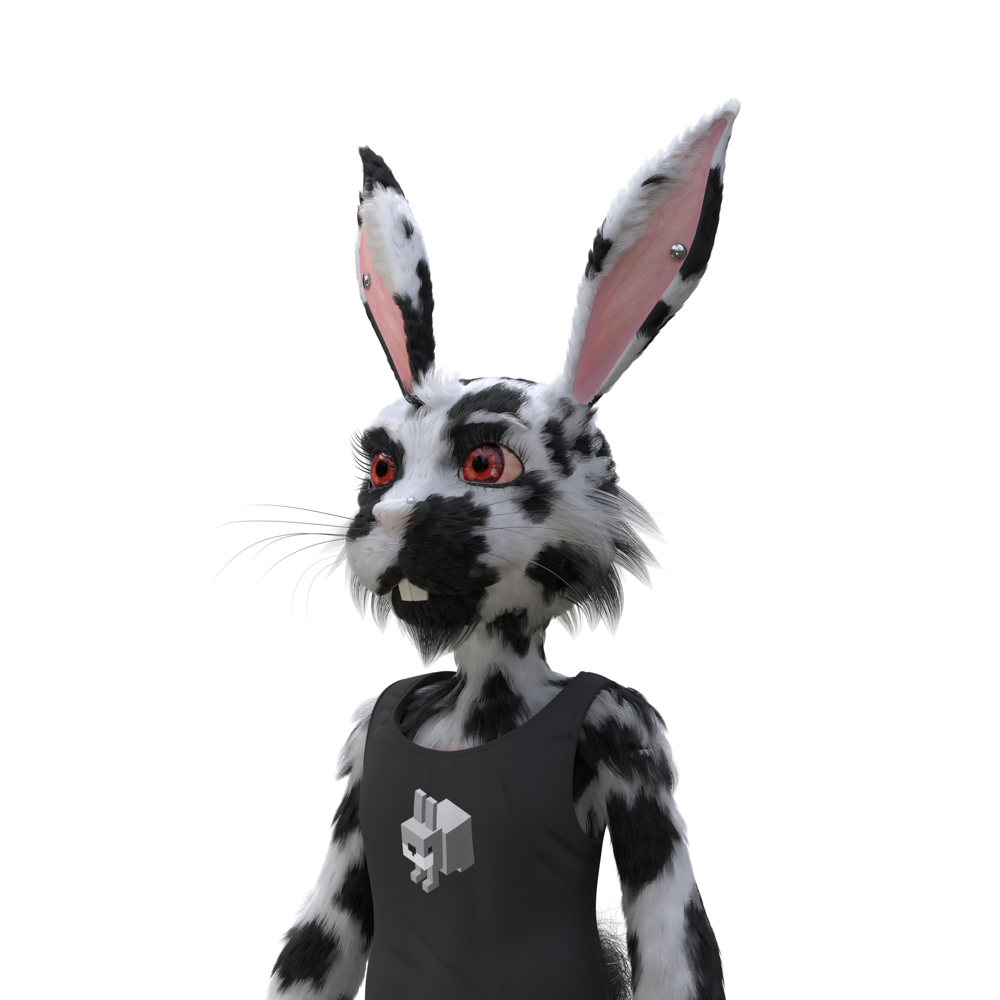
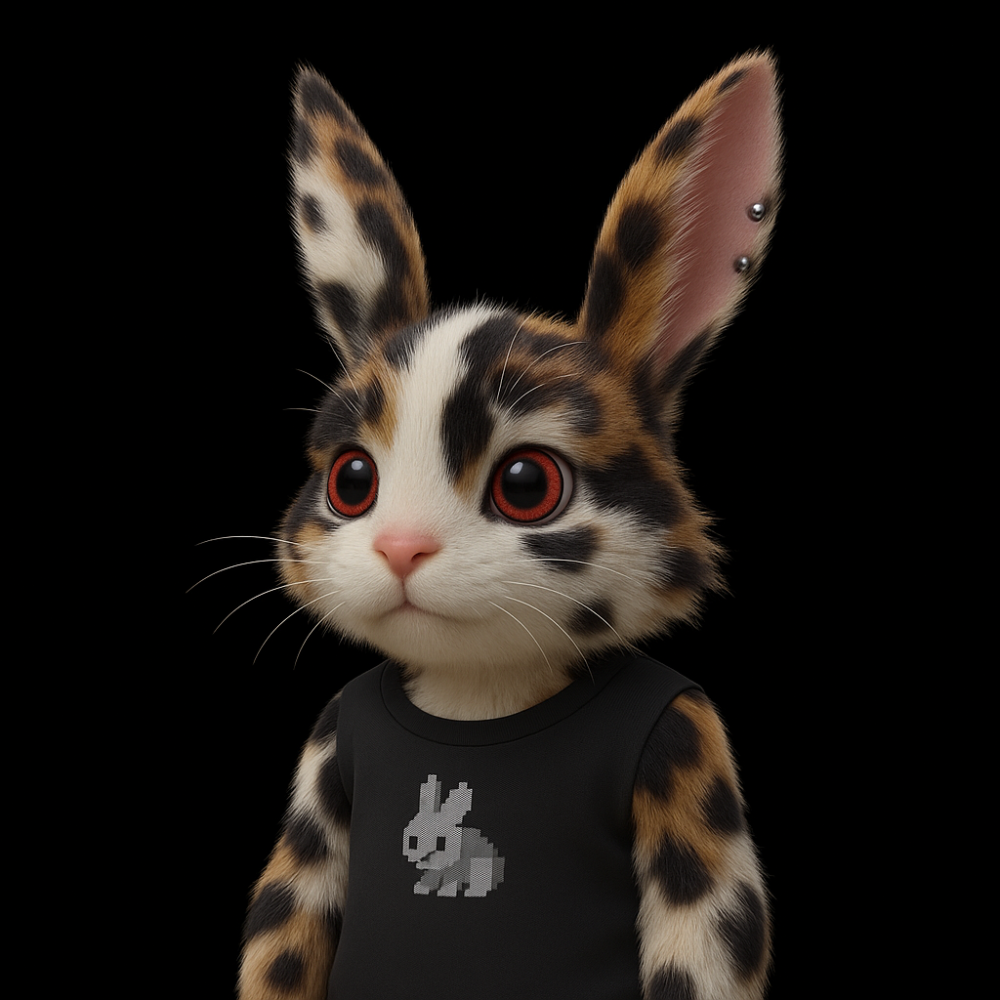
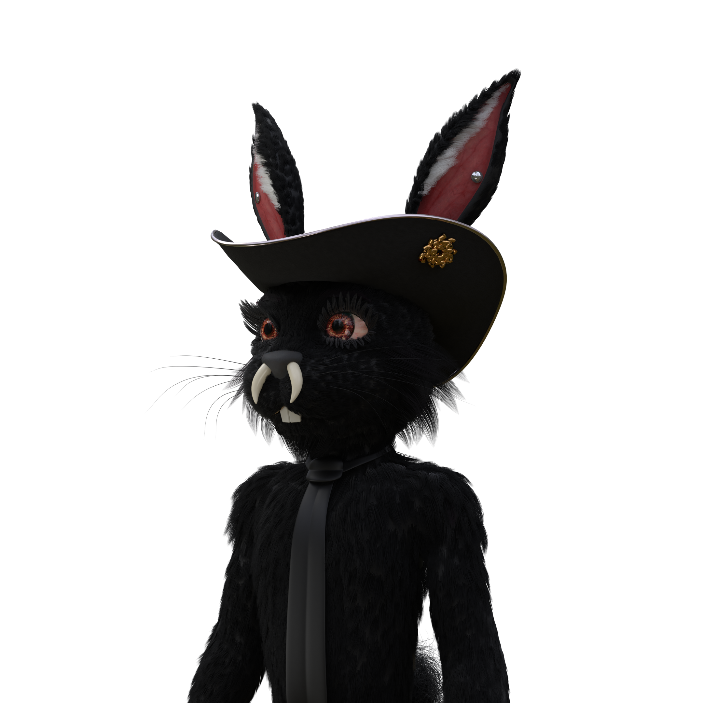
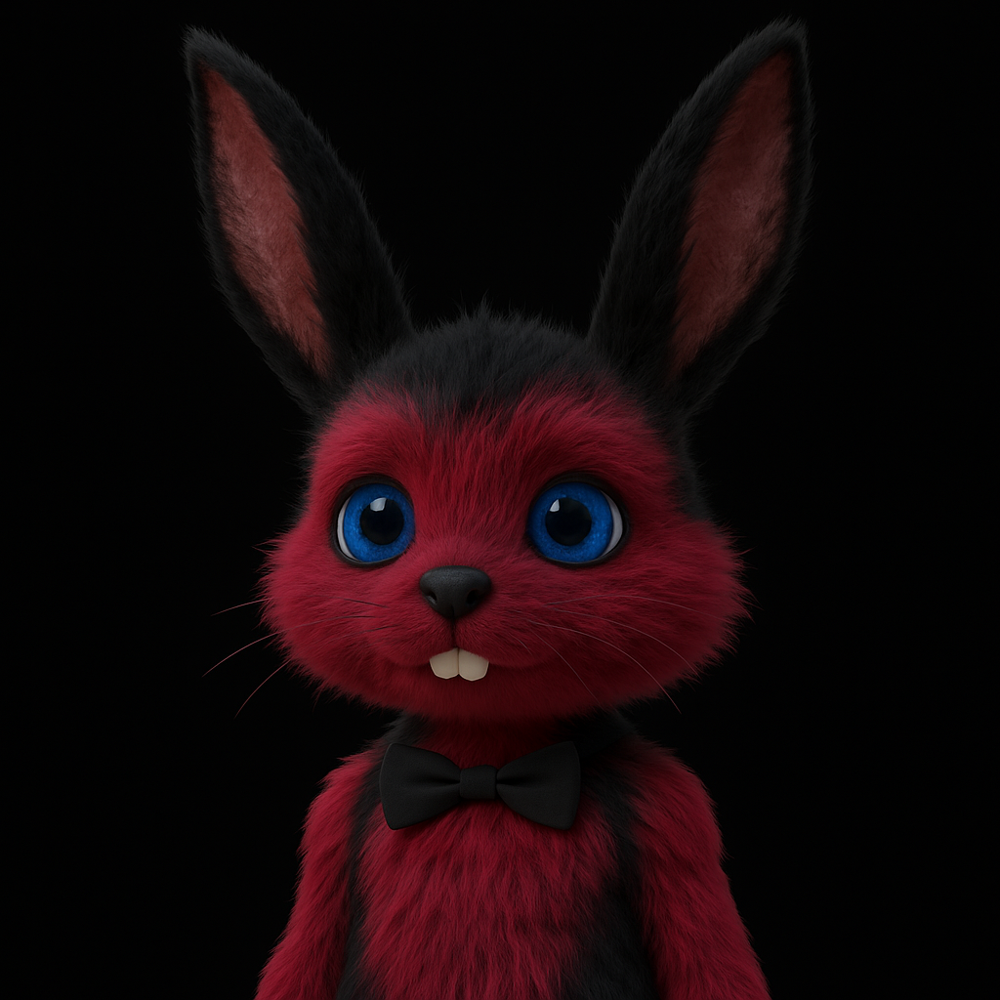

# BFM
**Bunny Fuk Mechanics - Community driven Fluf Breeding Concept**

|                             Male                             |                            Female                            |                           Fluflet                            |
| :----------------------------------------------------------: | :----------------------------------------------------------: | :----------------------------------------------------------: |
|  |  |  |
|  |  |  |
|  |  |  |


## Concept

**Fluflets** introduce a new generational layer to the original **Fluf collection (10K supply: 7K male / 3K female)**, creating sustainable value accrual through AI-powered breeding mechanics and dynamic scarcity controls.

### Core Value Proposition

- **Female Scarcity Premium**: With only 3K females vs 7K males, female Flufs become essential breeding assets
- **Trait-Based Breeding**: Parent Fluf traits directly influence Fluflet outcomes, driving demand for rare trait combinations
- **Village Multiplier**: Holding multiple Fluf pairs amplifies breeding success and Fluflet rarity potential
- **Dynamic Supply**: Demand-responsive scarcity controls ensure Fluflets remain valuable as the ecosystem grows

### Investment Thesis

Fluflets transform Fluf from static PFPs into **breeding infrastructure** - essential assets for accessing the next generation. The combination of female scarcity, trait premiums, and dynamic supply creates multiple value vectors that compound over time, making Fluf a blue-chip breeding asset in the metaverse economy.

## Deep Dive

### Breeding Mechanics

**Tier-Based Breeding System:**
- **Basic Pairs** (Common traits): Standard breeding rate, 1-2 Fluflets per season
- **Rare Pairs** (Uncommon combinations): 1.5x multiplier, mutation access, 2-3 Fluflets per season  
- **Legendary Pairs** (Rare combinations): 2x multiplier, guaranteed inheritance, 3-4 Fluflets per season

**Seasonal Breeding Windows:**
- Quarterly breeding seasons (3-4 months apart)
- Each Fluf has lifetime breeding limits (1-2 total offspring)
- Not all pairs guaranteed success each season - lottery/access pass mechanics

**Trait Inheritance Matrix:**
- Parent traits directly influence Fluflet outcomes
- Rare trait combinations unlock exclusive Fluflet traits
- Female traits provide premium breeding bonuses

### Village Multiplier & Whale Control

**Village Mechanics:**
- Breeding success amplified by total Flufs in wallet ("village size")
- Larger villages unlock faster evolution, rarer traits, mutations
- Multiplier caps at **7 pairs (14 Flufs)** - beyond this, more breeding cycles but no further evolutionary advantage

**Female Premium Mechanics:**
- Each female has limited lifetime breeding opportunities
- Rare female traits unlock exclusive Fluflet traits
- "Female stud fees" - rare females can generate passive income

### Dynamic Scarcity Controls

**Adaptive Supply Formula:**
```
Season Supply = (Active Breeding Pairs × Base Rate) × Demand Multiplier
- Base Rate: 0.1-0.3 Fluflets per eligible pair
- Demand Multiplier: 0.5-2.0x based on market signals
```

**Market Signal Integration:**
- Fluf floor price trends
- Breeding activity volume  
- Fluflet secondary market performance
- Holder retention rates

**Supply Adjustment Triggers:**
- Fluf floor drops → reduce Fluflet supply
- Breeding demand spikes → temporary supply increase
- Holder retention drops → boost breeding rewards

### Advanced Mechanics

**Staking Integration:**
- Stake Flufs for breeding bonuses
- Longer staking periods = better breeding outcomes
- Unstaking penalties during breeding seasons

**Breeding Investment Tiers:**
- **Basic**: Use existing Flufs only
- **Premium**: Add ETH/materials for better outcomes  
- **Deluxe**: Special breeding events with guaranteed rare traits

**Care Requirements:**
- Fluflets must be nurtured post-mint to mature
- Neglected Fluflets risk devolving into common forms
- Creates natural burn mechanism and ongoing engagement

## Proof of Concept (POC)

The technical implementation follows a streamlined pipeline that leverages existing infrastructure and AI services:

### Technical Flow

1. **Asset Discovery**: Integration with [FuturePass](https://futurepass.id/) to interrogate user wallets and identify Male/Female Fluf NFT pairs in their holdings.

2. **Pair Selection**: Users can select breeding pairs from their discovered Fluf collection through an intuitive interface.

3. **Image Reference**: The system references transparent PNG images stored on AWS, providing clean visual data for AI processing.

4. **AI Generation**: Selected Fluf images are passed to the ChatGPT API with optimized prompts to generate unique Fluflet offspring images that inherit traits from both parents.

5. **3D Asset Creation**: Generated Fluflet images are processed through a third-party 3D object generation API to create rigged, animated 3D assets suitable for gaming and metaverse applications.

6. **Minting & Distribution**: Final 3D Fluflet assets are minted using [Lum3n](https://www.lum3n.xyz/) infrastructure, ensuring seamless integration with existing NFT marketplaces and wallet systems.
